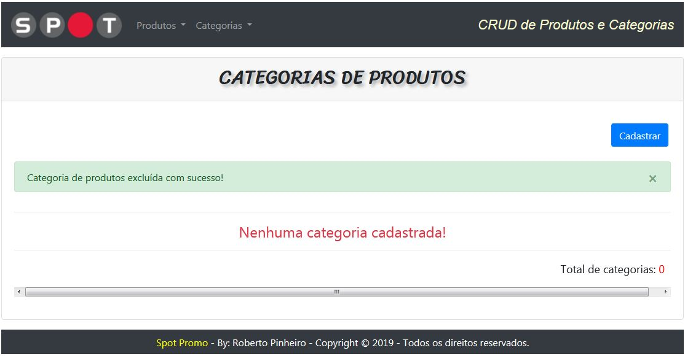
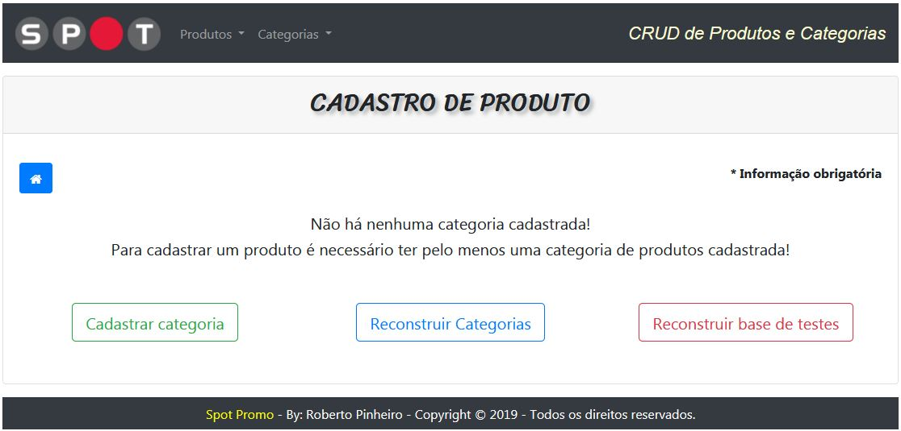
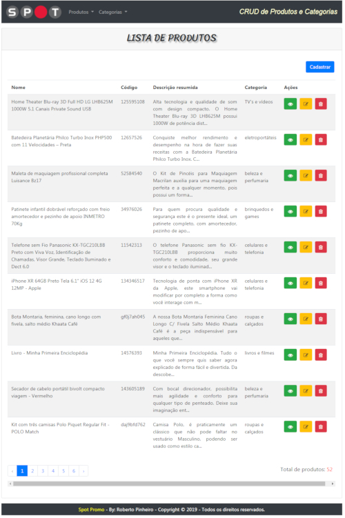
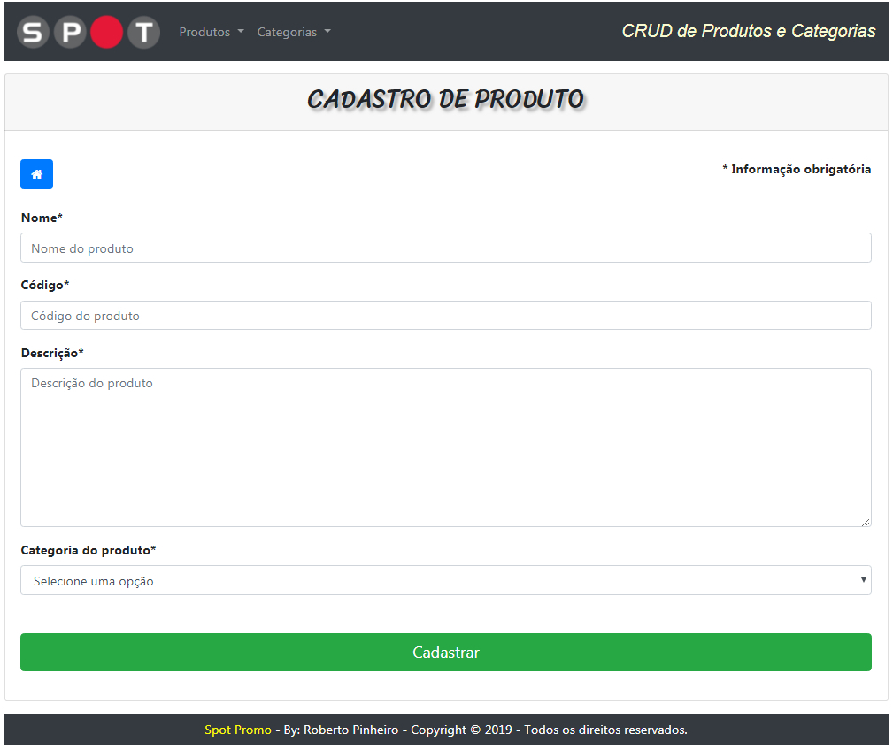
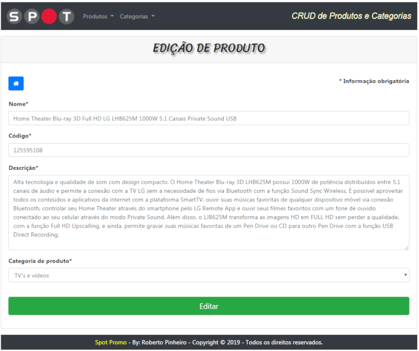
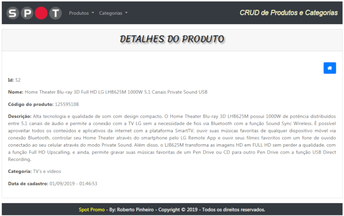
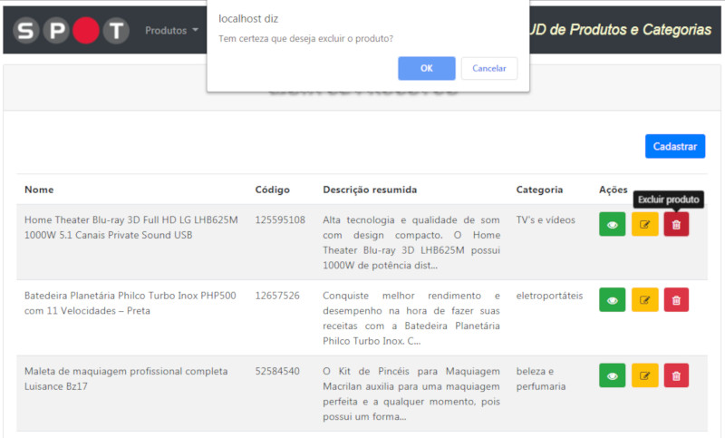

# CRUD DE PRODUTOS E CATEGORIAS

## Sobre

Trata-se de um sistema básico de Gerenciamento de Produtos que permite criar, ler, editar (atualizar) e excluir produtos e categorias de produtos (**CRUD**).

## Características

- Sistema desenvolvido com PHP (versão 7.2.11) orientado a objetos
- Utiliza o framework Laravel versão 5.7.28
- Arquitetura da aplicação: padrão MVC (Model-View-Controller).
- Relacionamento entre a tabela de categoria de productos e a tabela de produtos.
- Utiliza o pacote Laravel Collective versão 5.5.0 para criação de formulários
- Design visual: Utiliza o framework front-end Bootstrap. É responsivo.
- Icones: utiliza o framework Font Awesome Icons

## Download

Inicialmente faça o download dos arquivos em meu [Github](https://github.com/betopinheiro1005/crud-produtos-categorias)

## Requisitos

Pacote de serviços integrados (xampp, wamp server, Laragon ou outro qualquer) que contenha:

- Servidor Apache
- PHP
- MySQL
- Ferramenta para administração de bancos de dados (como por exemplo, o phpmyadmin)

## Instalação

1. Crie em seu computador uma pasta com o nome **teste-spot** e descompacte os arquivos baixados nessa pasta.
2. Acesse o **phpmyadmin** com:
    - nome de usuário: **root**
    - senha: 

    **OBS**: Use senha em branco.

3. Crie um banco de dados com o nome ***teste-spot***.
4. Importe o arquivo  **teste-spot.sql** (disponível nos arquivos baixados). Será automaticamente criada a tabela do sistema populada com 52 registros de teste para produtos e 17 registros de teste para categorias de produtos.

## Uso

Para testar o aplicativo inicie o servidor local (Apache) e o MySQL. Em seguida, utilizando um navegador como o Google Chrome ou Firefox, entre com a seguinte URL:

> `http://localhost/teste-spot/public/`

## Refazendo testes com os registros iniciais (originais)

Depois de realizar diversos testes (criando, editando e excluindo categorias e produtos), caso queira, você pode recuperar as 17 categorias e/ou 52 produtos originais para refazer testes.

Há relacionamento entre as tabelas **products** e **categories**. Dessa forma, excluindo uma categoria, todos os produtos dessa categoria também serão excluídos.

Para refazer os testes com todos os 52 registros de produtos e 17 registros de categorias originais faça o seguinte:

- Inicialmente exclua os 17 registros de categorias. Fazendo isso não haverá mais produtos ou categorias registrados nas respectivas tabelas do banco de dados (ver tela 1).
- Depois disso, tente cadastrar um produto. Será exibida a tela 2:
- Clique no botão **Reconstruir base de testes**.
- Toda a base de testes original será automaticamente reconstruída.

Os outros dois botões são:

- **Reconstruir categorias**: Clicando nesse botão, serão reconstruídas apenas as 17 categorias de produtos, porém nenhuma delas com produtos cadastrados.
- **Cadastrar categoria**. Clicando nesse botão não será recuperado nenhuma categoria ou produto. Você apenas será redirecionado para o formulário de cadastro de categorias. Depois de cadastrar uma ou mais categorias de produtos, você poderá cadastrar produtos nessas categorias.

 

 

> Tela 1 - Tela após a exclusão de todas as categorias

 

 

> Tela 2 - Cadastro de produto quando não há nenhuma categoria cadastrada

  

## Screenshots - Products

 

 

> Tela 3 - Listando produtos - `http://localhost/teste-spot/public/products`

 

 

> Tela 4 - Cadastrando um produto - `http://localhost/teste-spot/public/products/create`

 

 

> Tela 5 - Editando um produto - `http://localhost/teste-spot/public/products/52/edit`

 

 

> Tela 6 - Exibindo detalhes de um produto - `http://localhost/teste-spot/public/products/52`

 

> Tela 7 - Excluindo um produto - `http://localhost/teste-spot/public/products/52/destroy`

 

#### OBS.; Os Screenshots de Categorias são semelhantes aos de Produtos.

 
